# OCS Saver

🍬 Saves a copy of each day's OCS messages to S3 for archiving and analysis.


### Setup

* [`asdf install`](https://github.com/asdf-vm/asdf)
* `npm install`

### Development

* Test suite: `npm test`
  * Watch mode: `npm test -- --watch`
* Format all files: `npm run format`
* Type checks: `npm run check`
* Linter checks: `npm run lint`

### Deployment

* Run the [Deploy to Dev][dev] or [Deploy to Prod][prod] workflow

[dev]: https://github.com/mbta/ocs_saver/actions/workflows/deploy-dev.yml
[prod]: https://github.com/mbta/ocs_saver/actions/workflows/deploy-prod.yml

### Useful links

* [Splunk logs](https://mbta.splunkcloud.com/en-US/app/search/search?q=search%20index%253Docs-saver-prod)
* [Sentry project](https://sentry.io/organizations/mbtace/projects/ocs-saver/?project=6204666)


## Other Tasks

Running `aws` commands requires [setting up the AWS CLI][aws]. If your AWS
account is in the TRC team group, you should have all required permissions.

[aws]: https://docs.aws.amazon.com/cli/latest/userguide/cli-chap-getting-started.html

### Deploy local code

1. Build a Lambda package: `./build.sh <entrypoint>`
2. Use `aws lambda update-function-code` to deploy the package (see the
   [deploy action](.github/actions/deploy/action.yml) for exact options)

### Manually run the packager

In the example below, replace `2022-01-01` with the date one day _after_ the
date of the package you want to generate. Use `prod` in place of `dev` to run
the prod environment packager.

```
aws lambda invoke \
  --invocation-type Event \
  --function-name ocs-saver-dev-packager \
  --payload '{"time": "2022-01-01T12:00:00Z"}' \
  --cli-binary-format raw-in-base64-out \
  /dev/stdout
```

This example uses async invocation, since a successful run can take longer than
the CLI's default read timeout. You'll have to use Splunk to monitor the status
of the run (filter by `source=lambda:ocs-saver-dev-packager-logs`).

Note that currently the packager intentionally fails when its output file
already exists; if you want to regenerate an output file, it must first be
deleted from S3.


## Architecture

This repo holds two separate scripts which are deployed to AWS Lambda:

* `processor` is the record processor for a Firehose delivery stream. Firehose
  receives records from the OCS messages Kinesis stream, runs them through the
  processor in batches, and delivers the "transformed" batches to an S3 bucket,
  one object per batch.

* `packager` is a standalone Lambda run once per day by an EventBridge rule
  (it can also be invoked manually). It downloads the previous day's Firehose
  output, concatenates it into a single file, and uploads it back to S3.

Since much of this behavior is defined in infrastructure rather than this repo,
it may also help to reference the [Terraform module][infra].

[infra]: https://github.com/mbta/devops/tree/master/terraform/modules/app-ocs-saver

```mermaid
flowchart LR
    subgraph EventBridge
        event[Daily Event Rule] -.->|invokes| packager{{Packager}}
    end
    subgraph Firehose
        Buffer -- record batches --> processor{{Processor}}
        processor -- raw OCS messages --> Delivery
    end
    subgraph S3
        failed(["/failed/[env]/[date]/…"])
        partial(["/partial/[env]/[date]/…"])
        package(["/[env]/[date].tar.gz"])
    end
    Kinesis -- records --> Buffer
    Delivery -- batches --> partial
    Delivery -- bad records --> failed
    partial -- prev. day batches --> packager
    packager --> package
```


